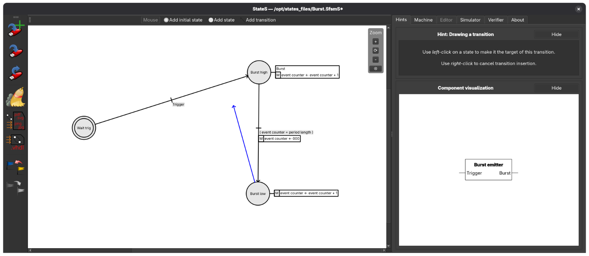
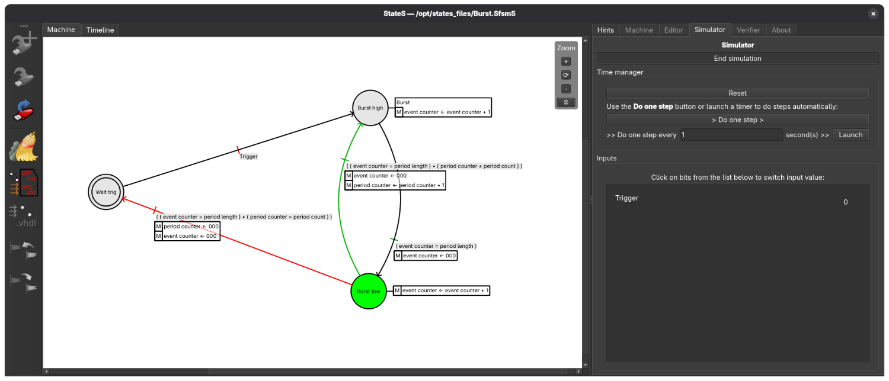
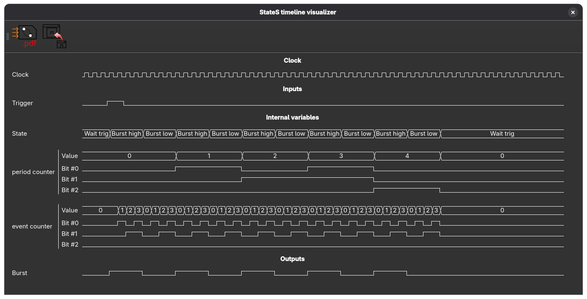

# StateS v. 0.4.8

StateS is intended to be a simple yet effective Finite State Machines (FSMs) tool.

Currently, StateS allows you to:

- Draw a FSM
- Simulate it
    - Animated graphic representation
    - Timeline for visualizing the evolution of variables values
- Verify it
- Export it graphically
    - as PDF
    - as vector image (SVG)
    - as bitmap image (PNG or Jpeg)
- Export it to code (**very experimental feature**)
    - VHDL

You can test interacting with a machine by loading one of the [demo files ](samples) (select a file then hit the "Download raw file" button on the top right).

### Drawing a FSM


### Simulating a FSM



## How to use
You'll find compiled versions for both Windows and Linux on [the `Releases` page](https://github.com/ClementFoucher/StateS/releases).

### Windows
Download and unzip the archive (or download the executable), then launch StateS_**.exe.

Latest versions of Windows are a bit strict on security, so you may obtain a security warning at opening.
Indeed, StateS is a very small application, not very well-known.
Windows sometimes automatically blocks this kind of programs when downloaded from the Internet.
The warning window is built to make difficult running the executable: the execution option is hidden.
I guarantee there is no malicious code in StateS, so to avoid the warning, right-click on the executable, choose "Properties", check "Unlock", and hit "OK".

The Windows version is built using [MinGW Qt6 static package](https://aur.archlinux.org/packages/mingw-w64-qt6-base-static) from ArchLinux.
The distributed version is a static (i.e. standalone, portable) 64-bits version.

### Linux
Download the appimage, make it executable if necessary then run the file.

To make the appimage file executable:
- From command line, cd to the folder containing the executable, and type `chmod +x ./<name of the file>`.
- Or graphically, right-click on the file, hit "Properties", search for an "Allow execution" or similar checkbox, and check it.

The Linux version is an [AppImage](https://en.wikipedia.org/wiki/AppImage) file (a self-contained archive) built using a Debian 13 virtual machine with [appimage-builder](https://appimage-builder.readthedocs.io/en/latest/).
I had to resort to using Debian for the packaging as appimage-builder struggles with ArchLinux.


## Bugs and development

**StateS is still in beta phase.**

If you think you found a bug in StateS, please [open an issue](https://github.com/ClementFoucher/StateS/issues) to report it.
Make sure to check the [known bugs file](text/known_bugs.txt?raw=true) first.

Remember StateS in still under heavy development!
It is not intended to be complete, or even useful for now!


## Obtaining code and generating StateS
StateS is licensed under the GNU GPL V2.
The license can be read in [the LICENSE file](LICENSE?raw=true), or at [this address](https://www.gnu.org/licenses/gpl-2.0.en.html).
Qt 6 is required to compile StateS, with modules `printsupport` and `svg` installed.
You'll also need git, CMake, a build tool like ninja or make and a C++ compiler like Clang or gcc.
The compiler must support C++ 2020.

To get the code, use the following command:
```bash
git clone https://github.com/ClementFoucher/StateS.git states
```
To compile, you first need to run `cmake .` in the root folder. You may want to customize the toolchain, e.g.:
```bash
cmake -G ninja -D CMAKE_CXX_COMPILER=/usr/bin/clang .
```
> NOTE: If your qt installation is not in PATH, you may need to use `qt-cmake` for CMake to be aware of your Qt installation path.

Then build the application:
```bash
cmake --build .
```

### Visual Studio issues
Under Windows, I recommand using the MinGW-based toolchain as Visual Studio has non-standard exception function signature.
If you still want to use VS, you may have to edit the source to make the function signature match before compilation.

## Third-party work

### Art
Most art used in the software is, or is based on, third-party art work released under open source licences.
Authors information and corresponding licences can be found in the "art" folder in the git repository ([here](art/AUTHORS?raw=true)).

### Code
StateS makes use of the [Diff Template Library](https://github.com/cubicdaiya/dtl) (dtl) © Tatsuhiko Kubo and released under the terms of the [BSD-3-Clause license](src/third_party/dtl/COPYING).
